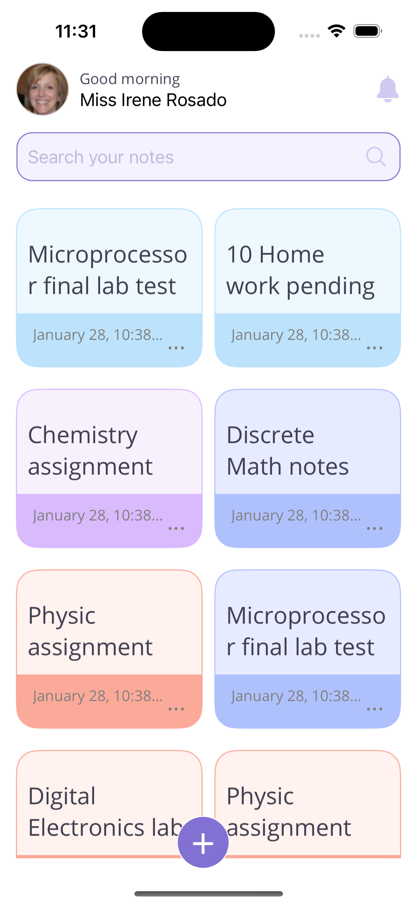
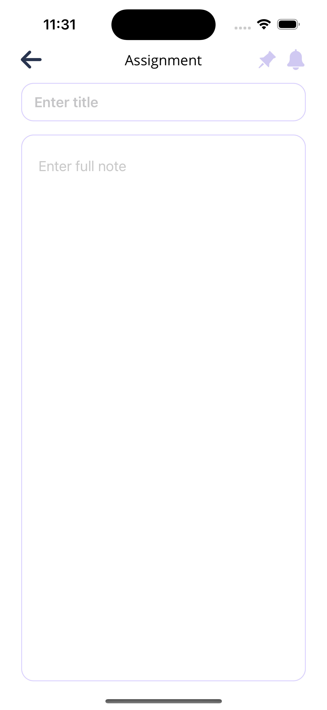

# MAUI TodoApp

This project was generated using .NET MAUI (.NET Multi-platform App UI) and Web Service .NET.

## .NET MAUI
### Topics used
* StaticResource
* DataBinding
* DataTemplate
* Styles
* Custom controls
* MAUI Handlers
* IoC

### Libraries
* Community Toolkit Maui
* Community Toolkit Mvvm

### Design
Author [Asiq M.](https://dribbble.com/asiq-netro)

Dribbble UI [Notebook Mobile App](https://dribbble.com/shots/23185462-Notebook-Mobile-App)**

## Web Service (CRUD)
### Topics used
* EntityFramework Core
* SQL Server
* Unit Of Work
* Migrations
* Repository
* PreLoad data seed

### Results

The complete code was generated by [Israel Calderón de la Cruz](https://icalderond.github.io/icalderond/)
